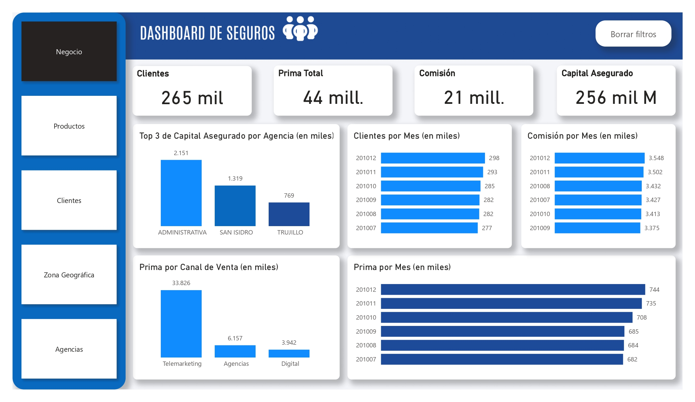
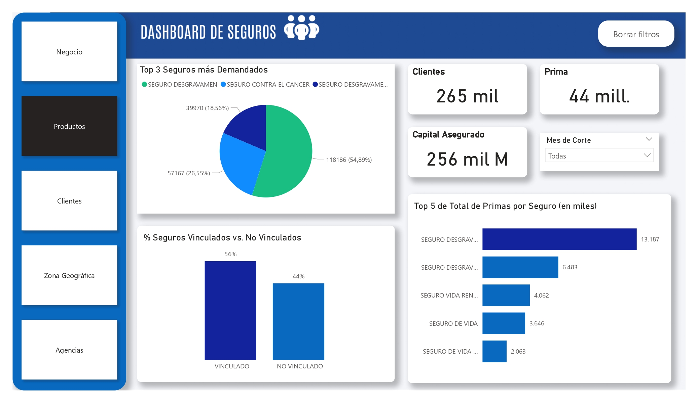
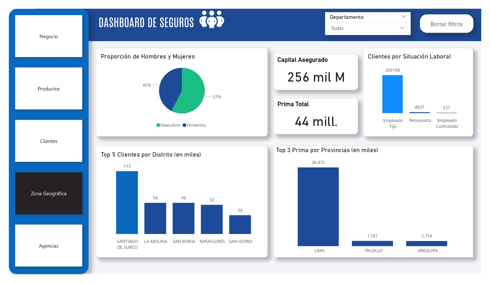

# 📊 Optimización en la Toma de Decisiones: Pacífico Seguros
## Implementación de Inteligencia de Negocios y Segmentación RFM

En el competitivo sector asegurador, la personalización y la retención son claves para la rentabilidad. Este proyecto presenta una solución de **Business Intelligence (BI)** de extremo a extremo, que transforma datos transaccionales crudos en estrategias de fidelización mediante un modelo de **Data Warehouse** y minería de datos con **RFM**

---

## 🎯 Objetivos del Proyecto

-   **Segmentación Avanzada**: Clasificar clientes de alto potencial para estrategias de venta cruzada (_cross-selling_).
    
-   **Optimización de Procesos**: Identificar canales de venta y agencias de mayor valor para maximizar la lealtad.
    
-   **Analítica Predictiva**: Proyectar tendencias de ventas mensuales utilizando modelos de series temporales.
    
-   **Fidelización**: Reducir el riesgo de fuga mediante programas personalizados para clientes de alto valor.

## 💻 El Ecosistema de Datos

El proyecto integra datos complejos de una operación que maneja:

-   **Cobertura**: 25 departamentos y más de 1,700 distritos en Perú.
    
-   **Volumen**: Más de 264,000 clientes y una facturación mensual aproximada de S/17 millones en primas.
    
-   **Fuentes**: Archivos planos (CSV) de Clientes, Seguros y Productos Financieros.

## 💻La data
🔗[Backup de Prueba de Seguros](https://drive.google.com/file/d/124dCxQKm28DorF_ZvK3nEEMUFdUQx0ra/view?usp=sharing)

## 🛠️ Stack Tecnológico

-   **SQL Server**: Motor de base de datos y scripts de limpieza/transformación.
    
-   **SSIS (Integration Services)**: Automatización del flujo ETL (Extract, Transform, Load).
    
-   **Power BI**: Creación de Dashboards interactivos para la explotación de datos.
    
-   **Modelo Estrella**: Arquitectura de datos optimizada para consultas analíticas

## ⚙️ Ingeniería de Datos (ETL & Automatización)

Se implementó un flujo de trabajo robusto en **Visual Studio (SSIS)** con las siguientes características:

-   **Staging Dinámico**: Creación y eliminación automática de tablas auxiliares (`_AUX`) para garantizar una ingesta de datos limpia.
    
-   **Cargas Incrementales**: Procesamiento paralelo de múltiples fuentes de datos.
    
-   **Gestión de Calidad**: Estandarización de códigos de agencia y completitud de datos (Ubigeo) mediante lógica SQL avanzada.
    
-   **Programación**: Automatización mediante **SQL Server Agent Jobs** para actualizaciones diarias.

## 🧠 Segmentación RFM (Data Mining)

Se desarrolló un modelo **RFM (Recencia, Frecuencia, Monto)** para calificar el comportamiento del cliente:

1.  **Recencia**: Días transcurridos desde la última compra de seguro.
    
2.  **Frecuencia**: Persistencia mensual del cliente en los registros.
    
3.  **Monto**: Valor promedio de primas, normalizado a moneda nacional (PEN).

**Resultados de Segmentación:** 🔗[Analisis RFM Seguros.xlsx](https://docs.google.com/spreadsheets/d/1aQTSGm3MDTOoWVn4LQTw6q84pZ8CKRNo/edit?usp=sharing&ouid=114699823279101853963&rtpof=true&sd=trueg)

## 💡 Insights Principales

-   **Canal Líder**: El canal de **Telemarketing** cubre el **73%** de todas las transacciones realizadas.
    
-   **Producto Estrella**: El **Seguro Desgravamen Casa** es el más rentable, representando el **28%** de la prima total.
    
-   **Tendencia**: Se identificó un crecimiento mensual promedio de aproximadamente **S/200,000** en primas.

## 📊 Visualización

El Dashboard final permite la explotación multidimensional, integrando:

-   Mapas de calor por zona geográfica.
    
-   Análisis de primas por canal de venta y agencia.
    
-   Detalle de clientes VIP y comportamiento por situación laboral.

### Vista del Dashboard

  
  
  
    

